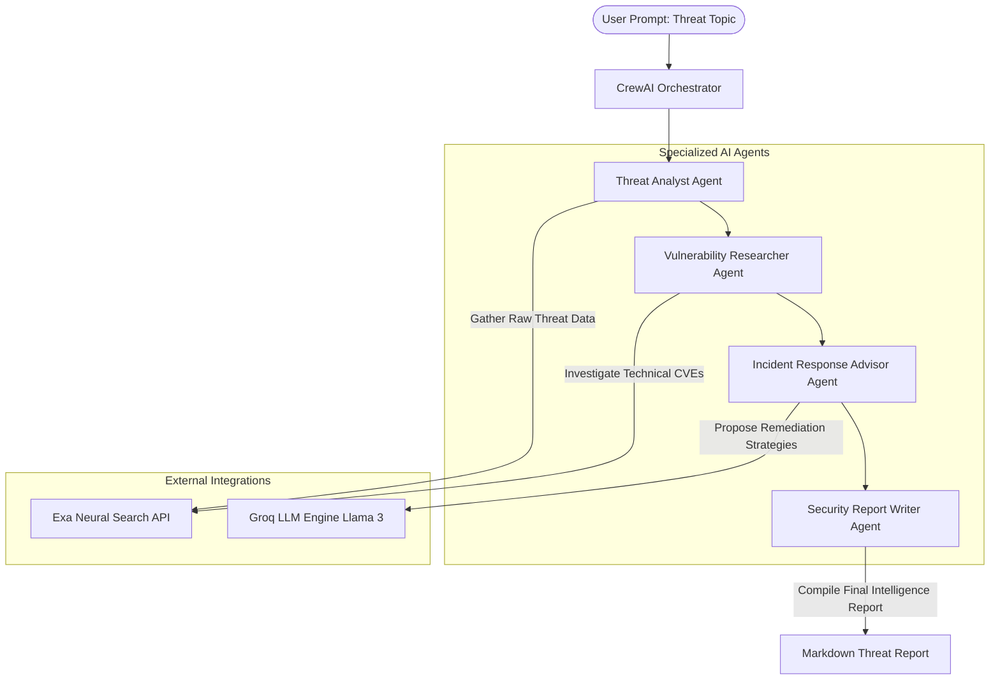

# AI-Powered Cybersecurity Intelligence System: Implementation Plan & Guide

This document outlines the step-by-step implementation plan for building an AI-driven Cybersecurity Intelligence System using **CrewAI**, **LangChain-Groq**, and the **Exa API**.

---

## 1. System Architecture

The system coordinates four specialized AI agents to automate the threat intelligence lifecycle:



---

## 2. Step-by-Step Implementation Steps

### Phase 1: Environment & API Setup
1. **Acquire API Keys:**
   * **Groq API Key:** Sign up at [Groq Console](https://console.groq.com/) and generate an API key. Groq provides fast inference speeds using LPU (Language Processing Unit) technology.
   * **Exa API Key:** Sign up at [Exa AI](https://exa.ai/) and generate an API key. Exa uses neural search to retrieve highly relevant web content optimized for LLM consumption.
2. **Project Workspace Setup:**
   * Create a folder named `Cybersecurity` (current workspace).
   * Initialize a virtual environment and activate it.

### Phase 2: Configuration & Code Layout
Create the following file structure in your directory:
```
Cybersecurity/
├── .env                  # API Credentials
├── requirements.txt      # Project Dependencies
├── tools.py              # Custom Exa Search Tool
├── agents.py             # Agent Definitions
├── tasks.py              # Task Specifications
└── main.py               # Main Orchestration Script
```

---

## 3. Code Implementations

### `requirements.txt`
```text
crewai>=0.28.0
langchain-groq>=0.1.3
exa-py>=1.0.7
python-dotenv>=1.0.1
```

### `.env`
```env
GROQ_API_KEY=your_groq_api_key_here
EXA_API_KEY=your_exa_api_key_here
```

### `tools.py`
```python
import os
from crewai.tools import tool
from exa_py import Exa
from dotenv import load_dotenv

load_dotenv()

@tool("Search Internet using Exa")
def search_exa(query: str) -> str:
    """
    Search the internet for real-time cybersecurity threats, malware campaigns, 
    vulnerabilities, CVE details, and active digital security campaigns using 
    Exa's neural search engine.
    """
    exa_client = Exa(api_key=os.getenv("EXA_API_KEY"))
    
    # Perform neural search with auto-prompting for optimal results
    response = exa_client.search_and_contents(
        query=query,
        num_results=5,
        text=True, # Retrieve clean text contents of search results
        highlights=True
    )
    
    # Format results nicely for the agent's context
    formatted_results = []
    for result in response.results:
        formatted_results.append(
            f"Title: {result.title}\n"
            f"URL: {result.url}\n"
            f"Highlight: {result.highlights[0] if result.highlights else 'N/A'}\n"
            f"Snippet: {result.text[:1000]}...\n"
            f"---"
        )
    
    return "\n\n".join(formatted_results)
```

### `agents.py`
```python
import os
from crewai import Agent, LLM
from tools import search_exa

# Define the Groq Llama 3 LLM configuration
groq_llm = LLM(
    model="groq/llama-3.1-70b-versatile",
    temperature=0.2,
    api_key=os.getenv("GROQ_API_KEY")
)

# Agent 1: Threat Analyst
threat_analyst = Agent(
    role="Lead Threat Intelligence Analyst",
    goal="Identify and monitor emerging cyber threats, active malware campaigns, and threat actor groups.",
    backstory=(
        "You are an elite cyber threat investigator with a background in OSINT (Open Source Intelligence). "
        "Your specialty is scanning the digital landscape to find early warning signs of cyber attacks, "
        "understanding threat actors' TTPs (Tactics, Techniques, and Procedures), and alerting organizations."
    ),
    tools=[search_exa],
    llm=groq_llm,
    verbose=True,
    allow_delegation=False
)

# Agent 2: Vulnerability Researcher
vulnerability_researcher = Agent(
    role="Senior Vulnerability Researcher",
    goal="Assess software vulnerabilities, CVE registries, and exploit mechanisms.",
    backstory=(
        "You are a reverse engineer and exploit analyst. You analyze security advisories, look into "
        "newly published CVEs, assess their severity (CVSS scores), and evaluate potential impact on IT systems."
    ),
    tools=[search_exa],
    llm=groq_llm,
    verbose=True,
    allow_delegation=False
)

# Agent 3: Incident Response Advisor
incident_response_advisor = Agent(
    role="Incident Response Specialist & Architect",
    goal="Formulate actionable mitigation plans, patching schedules, and defensive controls.",
    backstory=(
        "You are a seasoned defender and incident responder. You know how to configure firewalls, "
        "deploy YARA rules, write detection logic, and create immediate mitigation guides to safeguard networks "
        "against newly discovered threats."
    ),
    tools=[search_exa],
    llm=groq_llm,
    verbose=True,
    allow_delegation=False
)

# Agent 4: Cybersecurity Report Writer
report_writer = Agent(
    role="Principal Cybersecurity Technical Writer",
    goal="Synthesize intelligence data into clean, professional CISO-ready reports.",
    backstory=(
        "You translate technical jargon into executive summaries. You write clear, readable, and highly structured "
        "security threat reports containing concrete action steps, impact ratings, and security postures."
    ),
    tools=[],
    llm=groq_llm,
    verbose=True,
    allow_delegation=False
)
```

### `tasks.py`
```python
from crewai import Task
from agents import (
    threat_analyst, 
    vulnerability_researcher, 
    incident_response_advisor, 
    report_writer
)

# Task 1: Threat Identification
threat_detection_task = Task(
    description=(
        "Research recent reports and web articles on the following threat topic: '{topic}'. "
        "Identify key threat actors, active campaigns, systems being targeted, and infection vectors. "
        "Use the Exa Search tool to get the most up-to-date and accurate threat intelligence."
    ),
    expected_output=(
        "A detailed intelligence log containing identified threat actors, affected technologies, "
        "tactics/techniques used, and recent attack instances."
    ),
    agent=threat_analyst
)

# Task 2: Vulnerability Analysis
vulnerability_analysis_task = Task(
    description=(
        "Based on the threat intelligence gathered, search for corresponding CVEs, zero-days, or configuration flaws "
        "being exploited. Determine CVSS severity levels, affected software versions, and exploit availability."
    ),
    expected_output=(
        "A vulnerability registry sheet listing relevant CVE IDs, impact levels, technical descriptions of the exploits, "
        "and target system profiles."
    ),
    agent=vulnerability_researcher
)

# Task 3: Incident Mitigation Advice
mitigation_planning_task = Task(
    description=(
        "Develop an actionable Incident Response and Defense Strategy. Suggest specific firewalls, endpoint controls, "
        "YARA rules or detection signatures (if available), patch versions, and backup precautions to mitigate the "
        "exploited vulnerabilities and threat campaigns."
    ),
    expected_output=(
        "A defensive mitigation guide detailing immediate hotfixes, long-term patches, configuration updates, "
        "and monitoring criteria."
    ),
    agent=incident_response_advisor
)

# Task 4: Report Synthesis
report_compilation_task = Task(
    description=(
        "Synthesize the findings from threat detection, vulnerability analysis, and mitigation plans. "
        "Format the output into a premium, professional Markdown threat intelligence report. Include an Executive Summary, "
        "Threat Details, Technical Vulnerabilities, Defense Recommendations, and References."
    ),
    expected_output=(
        "A beautifully formatted markdown report ready for leadership, outlining the security threat, technical "
        "exposures, and mitigation steps."
    ),
    agent=report_writer,
    output_file="threat_intelligence_report.md"
)
```

### `main.py`
```python
import os
from crewai import Crew, Process
from dotenv import load_dotenv

# Ensure environment variables are loaded
load_dotenv()

from agents import (
    threat_analyst, 
    vulnerability_researcher, 
    incident_response_advisor, 
    report_writer
)
from tasks import (
    threat_detection_task, 
    vulnerability_analysis_task, 
    mitigation_planning_task, 
    report_compilation_task
)

def run_cyber_intelligence_crew(topic: str):
    """
    Kicks off the Cybersecurity Threat Intelligence crew.
    """
    print(f"[*] Initializing Cybersecurity Intelligence Crew for topic: '{topic}'...")
    
    # Instantiate the Crew
    cyber_crew = Crew(
        agents=[
            threat_analyst, 
            vulnerability_researcher, 
            incident_response_advisor, 
            report_writer
        ],
        tasks=[
            threat_detection_task, 
            vulnerability_analysis_task, 
            mitigation_planning_task, 
            report_compilation_task
        ],
        process=Process.sequential, # Execute sequentially as output of one is input for the next
        verbose=True
    )
    
    # Run the crew with inputs
    result = cyber_crew.kickoff(inputs={"topic": topic})
    
    print("\n[+] Crew execution completed successfully!")
    print(f"[+] Structured report written to: 'threat_intelligence_report.md'")
    return result

if __name__ == "__main__":
    # Example topic: "Ivanti VPN zero-day vulnerability exploits in 2024"
    # Change this to any trending threat topic of your choice.
    target_topic = "Ivanti VPN zero-day vulnerability exploits"
    run_cyber_intelligence_crew(target_topic)
```

---

## 4. Execution & Validation Plan

### Running the System
1. Install Python dependencies:
   ```bash
   pip install -r requirements.txt
   ```
2. Make sure you have populated the `.env` file with active **Groq** and **Exa** API keys.
3. Run the entry-point script:
   ```bash
   python main.py
   ```
4. Verify the output file `threat_intelligence_report.md` has been successfully generated in your directory.

---

## 5. Security & Best Practices

> [!IMPORTANT]
> **API Key Safety:** Never check in your `.env` file into version control repositories. Add `.env` to your `.gitignore`.
> **Agent Customization:** Adjust the `temperature` parameter on the Groq LLM configuration for more creative/analytical behavior. Low values (0.0 to 0.2) ensure factual and deterministic data processing.
